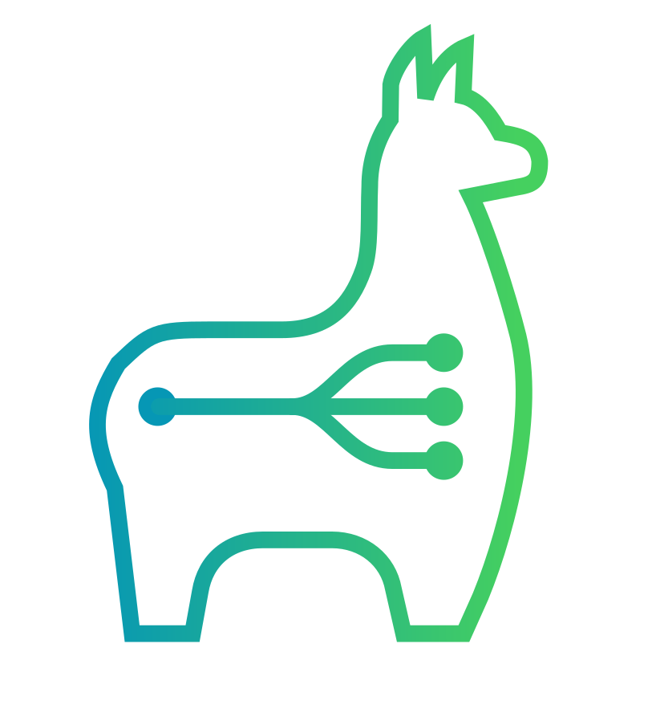
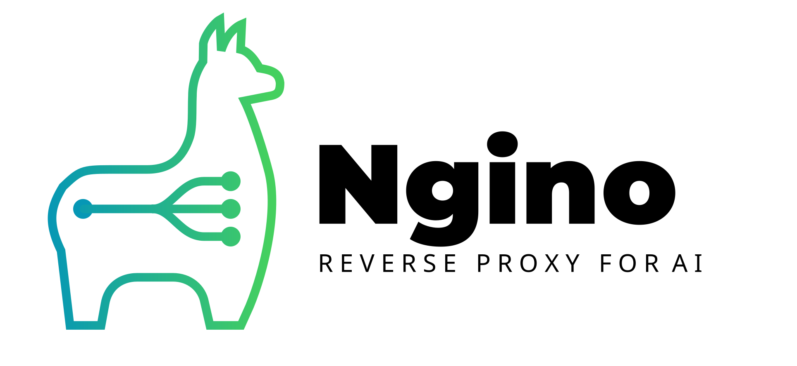

#  Ngino

Ngino is a small outbound HTTP tunnel for running Ollama, llama.cpp, vLLM, etc. on GPU workstations while exposing the API from a server that cannot reach those workstations directly.



The client opens and maintains a WebSocket connection to the server. The server accepts normal HTTP requests from users and forwards them through that WebSocket to the client. The client then calls a local upstream such as `http://localhost:11434` and streams the response back.

<table>
<tr>
<td></td>
<td>


The server provides
- An API with
  - Authentication via user keys
  - Authorization (planned)
- Load balancing (Scale your AI inferencing horizontally by adding more nodes!)
- (Ollama-based) GGUF Model management (install, remove, load, unload models)
- Client monitoring
  - Who is active
  - What models are running
  - How many requests is each client processing
  - How many requests has each client processed
- Group management (planned)
  - Who can access which models
  - What clients are mapped to which groups
- Billing (planned)
  - (planned) Price per model per thousand tokens
  - (planned) Usage per user key
  - (planned) Rate limiting

The client provides a persistent outbound connection to the server and forwards requests to the local Ollama (or vLLM, etc.) instance. Responses stream back through the tunnel with minimal overhead.

</td>
</tr>
</table>

[Screenshots of the app can be seen here](docs/Screenshots.md)


## Projects

- `src/Ngino.Server`: ASP.NET Core server. Exposes the public proxy endpoint and accepts the outbound client tunnel.
- `src/Ngino.Client`: Console client. Runs on the GPU machine and forwards requests to local Ollama.
- `src/Ngino.Protocol`: Shared tunnel message types.

## Run

Start the server:

```powershell
dotnet run --project src/Ngino.Server --urls http://0.0.0.0:5050
```

Open `http://your-server:5050/admin`, log in, and create a **user key** (for API access) and a **client key** (for the tunnel client). Make sure to write them down, as they are only shown once each.

Start the client on the GPU workstation, passing the client key as the token:

```powershell
dotnet run --project src/Ngino.Client -- --server http://your-server:5050 --upstream http://localhost:11434 --token "<client-key>"
```

Call Ollama through the server using the user key. Model-bearing requests on the root path are routed to a connected client that reports that model, preferring the client with the fewest in-flight requests. You can still address one client explicitly by id:

```powershell
curl.exe -H "X-Ngino-Token: <user-key>" http://your-server:5050/api/tags
curl.exe -H "X-Ngino-Token: <user-key>" http://your-server:5050/clients/gpu-01/api/tags
curl.exe http://your-server:5050/token/<user-key>/api/tags
curl.exe http://your-server:5050/token/<user-key>/clients/gpu-01/api/tags
```

```powershell
curl.exe -H "X-Ngino-Token: <user-key>" `
  -H "Content-Type: application/json" `
  -d '{"model":"llama3.1","prompt":"hello"}' `
  http://your-server:5050/api/generate
```

## Configuration

Server options:

- `--token <value>` or `NGINO_TOKEN`: optional shared secret for proxy calls (user auth). If set, proxy calls may authenticate with `X-Ngino-Token`, `Authorization: Bearer <token>`, or the `/token/<token>/...` path prefix instead of a user key. If unset, proxy calls require a user key created in the admin UI.
- `--client-token <value>` or `NGINO_CLIENT_TOKEN`: optional shared secret for tunnel client connections. If set, clients may authenticate with this value instead of a client key created in the admin UI. If unset, tunnel clients must present a client key. Not needed for the normal admin-UI workflow.
- `--tunnel-path <path>`: defaults to `/_ngino/tunnel`.
- `--status-path <path>`: defaults to `/_ngino/status`.
- `--chunk-size <bytes>` or `NGINO_CHUNK_SIZE`: defaults to `65536`.
- `--embedding-cache-path <path>` or `NGINO_EMBEDDING_CACHE_PATH`: SQLite cache file for embedding vectors. Defaults to `App_Data\embedding-cache.sqlite` under the server app directory.
- `--management-database-path <path>` or `NGINO_MANAGEMENT_DATABASE_PATH`: SQLite database for admin user keys, client keys, client disable state, and request/model metrics. Defaults to `App_Data\management.sqlite` under the server app directory.
- `--secure-cookies` or `NGINO_SECURE_COOKIES`: set to `false` to allow admin auth cookies over plain HTTP (for local development). Defaults to `true`.

Admin UI:

- `GET /admin` opens the Keycloak-protected management UI.
- The temporary Keycloak settings live under `Authentication:Keycloak` in `appsettings.json`.
- User keys created in the UI are accepted on the proxy endpoints via `X-Ngino-Token`, `Authorization: Bearer <key>`, or the `/token/<key>/...` path prefix. Query-string auth (`?token=...`) is only accepted on the status and tunnel endpoints.
- Client keys created in the UI authorize tunnel connections on the tunnel endpoint. Pass the key to the client via its `--token`/`NGINO_TOKEN`. Client keys are only accepted on the tunnel endpoint, and user keys are only accepted on the proxy endpoints.
- Model add/remove/load/unload commands are sent through the connected tunnel client to Ollama (`/api/pull`, `/api/delete`, `/api/generate`, and `/api/show`).

Client options:

- `--server <url>` or `NGINO_SERVER`: server base URL, for example `http://your-server:5050`.
- `--upstream <url>` or `NGINO_UPSTREAM`: local Ollama URL, defaults to `http://localhost:11434`.
- `--token <value>` or `NGINO_TOKEN`: the client key created in the admin UI, or the server's `--client-token` shared secret if that is configured. Sent to the server as `X-Ngino-Token` to authenticate the tunnel connection.
- `--client-id <name>` or `NGINO_CLIENT_ID`: identifies this machine on the server; defaults to the machine name.
- `--tunnel-path <path>` or `NGINO_TUNNEL_PATH`: defaults to `/_ngino/tunnel`.
- `--reconnect-delay <seconds>` or `NGINO_RECONNECT_DELAY_SECONDS`: defaults to `5`.

### Setting client options via environment variables

Every client option can be supplied either as a `--<name>` command line argument or as a `NGINO_<NAME>` environment variable (e.g. `--llama-cpp-parallel 8` and `NGINO_LLAMA_CPP_PARALLEL=8`). Where the installed service stores those variables depends on the operating system:

**Linux (systemd):** the service reads them from `/etc/ngino-client/env` via `EnvironmentFile=`. Each line is `NAME=value`. Edit the file and restart the service:

```bash
sudo nano /etc/ngino-client/env
# NGINO_SERVER=https://ai.domain.tld
# NGINO_TOKEN=<client-key>
# NGINO_USE_LLAMA_CPP_VIA_DOCKER=true
# NGINO_USE_OLLAMA_MODELS_PATH=/usr/share/ollama/.ollama/models
# NGINO_LLAMA_CPP_PARALLEL=8
sudo systemctl restart ngino-client
```

**Windows (service):** there is no env file; the variables are stored in the service registry key under the `Environment` multi-string value. Edit it and restart the service:

```powershell
$path = "HKLM:\SYSTEM\CurrentControlSet\Services\NginoClient"
$values = @(
    "NGINO_SERVER=https://ai.domain.tld",
    "NGINO_TOKEN=<client-key>",
    "NGINO_USE_LLAMA_CPP_VIA_DOCKER=true",
    "NGINO_USE_OLLAMA_MODELS_PATH=C:\Users\user\.ollama\models",
    "NGINO_LLAMA_CPP_PARALLEL=8"
)
Set-ItemProperty -Path $path -Name Environment -Value $values
Restart-Service NginoClient
```

The token is accepted as `X-Ngino-Token`, as `Authorization: Bearer <token>`, or as a path prefix like `/token/<token>/api/tags` or `/token/<token>/clients/{id}/v1`. The Bearer form lets OpenAI-compatible clients (e.g. n8n's OpenAI nodes pointed at `/clients/{id}/v1`) authenticate with their API-key field. The path-token form is useful for clients that cannot send custom headers. The server strips its own token header/Bearer value and removes the path prefix before forwarding; any other `Authorization` value is forwarded untouched.

## Multiple clients

Any number of machines can connect at the same time; each registers under its client id (machine name by default).

- `GET/POST /clients/{client-id}/...` forwards to that specific machine.
- The client reports its local Ollama model list from `/api/tags` when it connects and refreshes it every minute.
- The plain root path (`/api/...`, `/v1/...`) routes model-bearing requests to a client that reports the requested model, preferring the lowest in-flight request count. Requests without a model are sent to the connected client with the fewest in-flight requests.
- The status endpoint lists all connected clients, their in-flight request counts, and their last reported model lists.
- If a client connects with an id that is already in use, the old connection is replaced and the replaced client exits instead of reconnecting.

## Embedding cache

The server keeps an in-memory KV cache for embedding vectors and persists it to SQLite. The cache key is the requested `model` plus the exact input text. It applies to `POST /api/embed`, `POST /api/embeddings`, and `POST /v1/embeddings`; cache hits return JSON in the same endpoint family shape and include `X-Ngino-Embedding-Cache: hit`.

The authenticated status endpoint reports whether the cache is available, plus the cache count and database path. If SQLite cannot be initialized, proxy traffic continues without embedding-cache writes.

## Client installer

Linux:

```bash
sudo bash deploy/install-client.sh --server http://your-server:5050 --token "<client-key>"
```
or using ollama models with llama.cpp backend using ROCm:
```bash
sudo bash deploy/install-client.sh   --server https://ai.domain.tld   --token "<client-key>"   --use-llama-cpp-via-docker   --use-ollama-models-path /usr/share/ollama/.ollama/models   --llama-cpp-docker-image ghcr.io/ggml-org/llama.cpp:server-rocm   --llama-cpp-base-port 8081   --llama-cpp-parallel 128
```
or using ollama models with llama.cpp backend using CUDA:
```bash
sudo bash deploy/install-client.sh   --server https://ai.domain.tld   --token "<client-key>"   --use-llama-cpp-via-docker   --use-ollama-models-path /usr/share/ollama/.ollama/models   --llama-cpp-docker-image ghcr.io/ggml-org/llama.cpp:server-cuda   --llama-cpp-base-port 8081   --llama-cpp-parallel 128
```

Options: `--server`, `--token` (required; the client key from the admin UI); `--client-id`, `--upstream`, `--install-dir`, `--service-name`, `--no-ollama` (optional). Missing required values are prompted interactively.

llama.cpp via Docker options (replaces Ollama for inferencing):

| Option | Env variable | Description |
|--------|--------------|-------------|
| `--use-llama-cpp-via-docker` | `NGINO_USE_LLAMA_CPP_VIA_DOCKER` | Use llama.cpp Docker containers instead of Ollama |
| `--use-ollama-models-path <dir>` | `NGINO_USE_OLLAMA_MODELS_PATH` | Path to Ollama models directory (`manifests/blobs`); required with the flag above |
| `--llama-cpp-docker-image ` | `NGINO_LLAMA_CPP_DOCKER_IMAGE` | Docker image; defaults to auto-detected (rocm/cuda/cpu) |
| `--llama-cpp-base-port <num>` | `NGINO_LLAMA_CPP_BASE_PORT` | Base port for containers; defaults to `8081` |
| `--llama-cpp-parallel <num>` | `NGINO_LLAMA_CPP_PARALLEL` | llama.cpp parallel slots per container; if unset, llama.cpp's own default is used (which is `1`) |
| `--llama-cpp-fallback-cooldown <sec>` | `NGINO_LLAMA_CPP_FALLBACK_COOLDOWN_SECONDS` | Seconds before llama.cpp is retried after a failed container start; defaults to `180` |
| `--log-dir <dir>` | `NGINO_LOG_DIR` | Directory for log files; defaults to `<app dir>/Logs` |

### llama.cpp fallback to Ollama

Models are served via llama.cpp Docker containers. If a container cannot be started for a model (for example, the model's GGUF blob is incompatible with the llama.cpp build), the client falls back to the Ollama upstream for that model. Transient start failures are remembered for `--llama-cpp-fallback-cooldown` seconds (default 3 minutes) and then retried; a container that starts but exits before becoming ready marks the model as falling back until it is unloaded. `load`/`unload` model commands and on-demand request routing are all covered; a failed container start is detected quickly by watching the container state, and the container log tail is written to the client log to aid debugging.

Note: some hybrid SSM/attention models (e.g. `qwen3-coder-next`) are converted by Ollama into a GGUF tensor layout that stock llama.cpp cannot load (`missing tensor 'blk.0.ssm_dt.bias'` and similar). Such models are served via the Ollama fallback above. If you want them to run on llama.cpp instead, use a Hugging Face-converted GGUF (e.g. `unsloth/Qwen3-Coder-Next-GGUF`) rather than the Ollama blob.

Note: some multimodal models (e.g. `gemma4`) are packed by Ollama into a single GGUF blob containing the whole model - the text tower plus embedded vision (`v.*`), audio (`a.*`), and projector (`mm.*`) tensors (a `gemma4` blob bundles 2131 tensors, only ~720 of which belong to the text tower). Stock llama.cpp's `gemma4` loader implements only the text tower and refuses the file because it must account for every tensor in it (`done_getting_tensors: wrong number of tensors; expected 2131, got 720`). Ollama can serve these blobs because its bundled llama.cpp carries a compatibility layer (`ollama/ollama`, `llama/compat/`) that hides the embedded vision/audio/projector tensors from the text loader. Such models are served via the Ollama fallback above. If you want them to run on llama.cpp instead, use a text-only GGUF from Hugging Face (e.g. `ggml-org/gemma-4-E2B-it-GGUF`) imported into Ollama with `ollama create`, rather than the Ollama multimodal blob.

The script ensures .NET 10 and Ollama are installed, builds the client self-contained, installs it to `/opt/Ngino-client`, and creates a systemd service (`Ngino-client`). Logs: `journalctl -u Ngino-client -f`.

## Notes

- Request and response bodies are streamed through the tunnel, which is important for Ollama streaming responses.

## Security notes

- Use HTTPS or a private network/VPN when exposing this outside a trusted network.
- **Tokens in URLs** (`/token/<token>/...` and `?token=...`) are logged by web servers (Apache, Nginx, Kestrel), reverse proxies, and browsers (history). Malicious MITM proxies can also read them. Prefer header-based auth (`X-Ngino-Token` or `Authorization: Bearer`) when your client supports it.
- The token is simple shared-secret protection, not a full access-control system.

## AI Disclosure

This project was architected by humans.
The code was mostly authored by multiple AI models:

- Claude Fable 5
- ChatGPT 5.5
- OpenCode Big Pickle
- Qwen3-coder-next:latest
