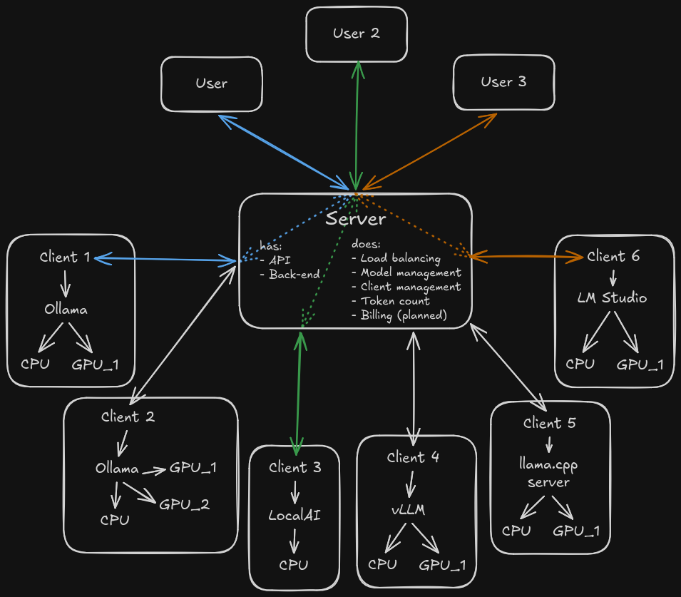

# Ngino

Ngino is a small outbound HTTP tunnel for running Ollama (or vLLM, etc.) on GPU workstations while exposing the API from a server that cannot reach those workstations directly.

The client opens and maintains a WebSocket connection to the server. The server accepts normal HTTP requests and forwards them through that WebSocket to the client. The client then calls a local upstream such as `http://localhost:11434` and streams the response back.

<table>
<tr>
<td></td>
<td>


The server provides
- An API with
  - Authentication via user keys
  - Authorization (planned)
- Load balancing (Scale your AI strategy horizontally!)
- (Ollama-only) Model management (install, remove, load, unload models)
- Client monitoring
  - Who is active
  - What models are running
  - How many requests is each client processing
  - How many requests has each client processed
- Group management (planned)
  - Who can access which models
  - What clients are mapped to which groups
- Billing (planned)
  - (planned) Price per model per thousand tokens
  - (planned) Usage per user key
  - (planned) Rate limiting

The client provides a persistent outbound connection to the server and forwards requests to the local Ollama (or vLLM, etc.) instance. Responses stream back through the tunnel with minimal overhead.

</td>
</tr>
</table>

[Screenshots of the app can be seen here](docs/Screenshots.md)


## Projects

- `src/Ngino.Server`: ASP.NET Core server. Exposes the public proxy endpoint and accepts the outbound client tunnel.
- `src/Ngino.Client`: Console client. Runs on the GPU machine and forwards requests to local Ollama.
- `src/Ngino.Protocol`: Shared tunnel message types.

## Run

Start the server:

```powershell
dotnet run --project src/Ngino.Server --urls http://0.0.0.0:5050 -- --token "change-me"
```

Start the client on the GPU workstation:

```powershell
dotnet run --project src/Ngino.Client -- --server http://your-server:5050 --upstream http://localhost:11434 --token "change-me"
```

Call Ollama through the server. Model-bearing requests on the root path are routed to a connected client that reports that model, preferring the client with the fewest in-flight requests. You can still address one client explicitly by id:

```powershell
curl.exe -H "X-Ngino-Token: change-me" http://your-server:5050/api/tags
curl.exe -H "X-Ngino-Token: change-me" http://your-server:5050/clients/gpu-01/api/tags
curl.exe http://your-server:5050/token/change-me/api/tags
curl.exe http://your-server:5050/token/change-me/clients/gpu-01/api/tags
```

```powershell
curl.exe -H "X-Ngino-Token: change-me" `
  -H "Content-Type: application/json" `
  -d '{"model":"llama3.1","prompt":"hello"}' `
  http://your-server:5050/api/generate
```

## Configuration

Server options:

- `--token <value>` or `NGINO_TOKEN`: optional shared token. If set, proxy calls must authenticate with `X-Ngino-Token`, `Authorization: Bearer <token>`, or the `/token/<token>/...` path prefix.
- `--tunnel-path <path>`: defaults to `/_ngino/tunnel`.
- `--status-path <path>`: defaults to `/_ngino/status`.
- `--chunk-size <bytes>` or `NGINO_CHUNK_SIZE`: defaults to `65536`.
- `--embedding-cache-path <path>` or `NGINO_EMBEDDING_CACHE_PATH`: SQLite cache file for embedding vectors. Defaults to `App_Data\embedding-cache.sqlite` under the server app directory.
- `--management-database-path <path>` or `NGINO_MANAGEMENT_DATABASE_PATH`: SQLite database for admin user keys, client keys, client disable state, and request/model metrics. Defaults to `App_Data\management.sqlite` under the server app directory.
- `--secure-cookies` or `NGINO_SECURE_COOKIES`: set to `false` to allow admin auth cookies over plain HTTP (for local development). Defaults to `true`.

Admin UI:

- `GET /admin` opens the Keycloak-protected management UI.
- The temporary Keycloak settings live under `Authentication:Keycloak` in `appsettings.json`.
- User keys created in the UI are accepted anywhere the shared token is accepted: `X-Ngino-Token`, `Authorization: Bearer <key>`, `?token=...`, and `/token/<key>/...`.
- Model add/remove/load/unload commands are sent through the connected tunnel client to Ollama (`/api/pull`, `/api/delete`, `/api/generate`, and `/api/show`).

Client options:

- `--server <url>` or `NGINO_SERVER`: server base URL, for example `http://your-server:5050`.
- `--upstream <url>` or `NGINO_UPSTREAM`: local Ollama URL, defaults to `http://localhost:11434`.
- `--token <value>` or `NGINO_TOKEN`: optional shared token.
- `--client-id <name>` or `NGINO_CLIENT_ID`: identifies this machine on the server; defaults to the machine name.
- `--tunnel-path <path>` or `NGINO_TUNNEL_PATH`: defaults to `/_ngino/tunnel`.
- `--reconnect-delay <seconds>` or `NGINO_RECONNECT_DELAY_SECONDS`: defaults to `5`.
- `--chunk-size <bytes>` or `NGINO_CHUNK_SIZE`: defaults to `65536`.

The token is accepted as `X-Ngino-Token`, as `Authorization: Bearer <token>`, or as a path prefix like `/token/<token>/api/tags` or `/token/<token>/clients/{id}/v1`. The Bearer form lets OpenAI-compatible clients (e.g. n8n's OpenAI nodes pointed at `/clients/{id}/v1`) authenticate with their API-key field. The path-token form is useful for clients that cannot send custom headers. The server strips its own token header/Bearer value and removes the path prefix before forwarding; any other `Authorization` value is forwarded untouched.

## Multiple clients

Any number of machines can connect at the same time; each registers under its client id (machine name by default).

- `GET/POST /clients/{client-id}/...` forwards to that specific machine.
- The client reports its local Ollama model list from `/api/tags` when it connects and refreshes it every minute.
- The plain root path (`/api/...`, `/v1/...`) routes model-bearing requests to a client that reports the requested model, preferring the lowest in-flight request count. Requests without a model are sent to the connected client with the fewest in-flight requests.
- The status endpoint lists all connected clients, their in-flight request counts, and their last reported model lists.
- If a client connects with an id that is already in use, the old connection is replaced and the replaced client exits instead of reconnecting.

## Embedding cache

The server keeps an in-memory KV cache for embedding vectors and persists it to SQLite. The cache key is the requested `model` plus the exact input text. It applies to `POST /api/embed`, `POST /api/embeddings`, and `POST /v1/embeddings`; cache hits return JSON in the same endpoint family shape and include `X-Ngino-Embedding-Cache: hit`.

The authenticated status endpoint reports whether the cache is available, plus the cache count and database path. If SQLite cannot be initialized, proxy traffic continues without embedding-cache writes.

## Client installer

Linux:

```bash
sudo bash deploy/install-client.sh --server http://your-server:5050 --token "change-me"
```

Options: `--server`, `--token` (required); `--client-id`, `--upstream`, `--install-dir`, `--service-name`, `--no-ollama` (optional). Missing required values are prompted interactively.

The script ensures .NET 10 and Ollama are installed, builds the client self-contained, installs it to `/opt/Ngino-client`, and creates a systemd service (`Ngino-client`). Logs: `journalctl -u Ngino-client -f`.

## Notes

- Request and response bodies are streamed through the tunnel, which is important for Ollama streaming responses.

## Security notes

- Use HTTPS or a private network/VPN when exposing this outside a trusted network.
- **Tokens in URLs** (`/token/<token>/...` and `?token=...`) are logged by web servers (Apache, Nginx, Kestrel), reverse proxies, and browsers (history). Malicious MITM proxies can also read them. Prefer header-based auth (`X-Ngino-Token` or `Authorization: Bearer`) when your client supports it.
- The token is simple shared-secret protection, not a full access-control system.

## AI Disclosure

This project was architected by humans.
The code was mostly authored by multiple AI models:

- Claude Fable 5
- ChatGPT 5.5
- OpenCode Big Pickle
- Qwen3-coder-next:latest
